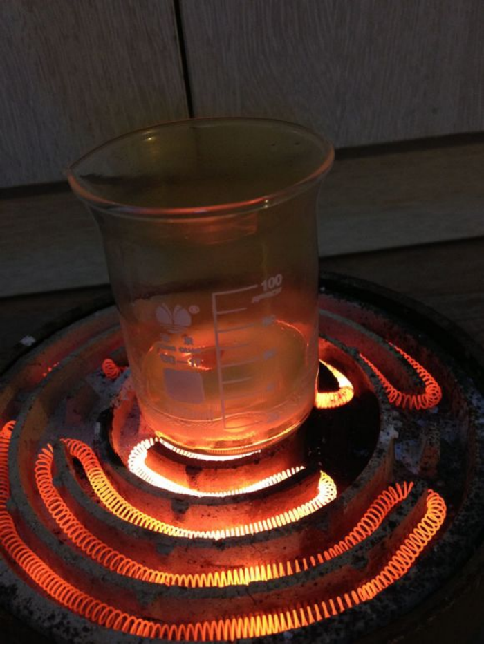
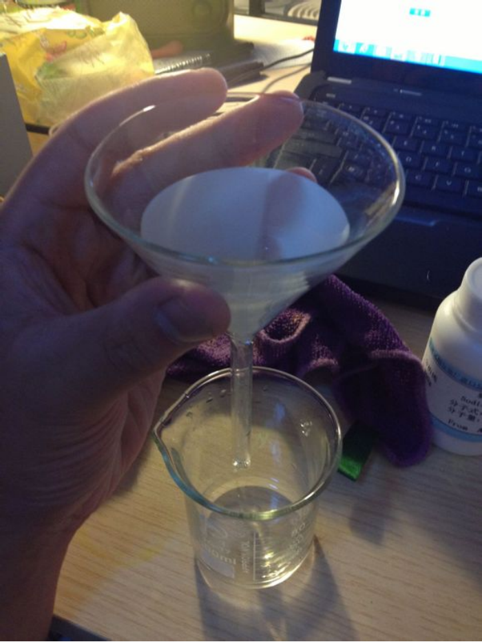
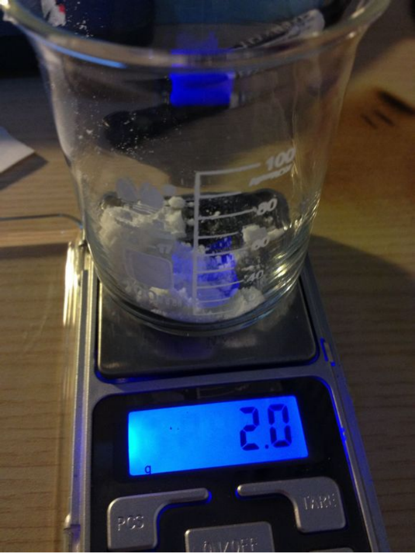
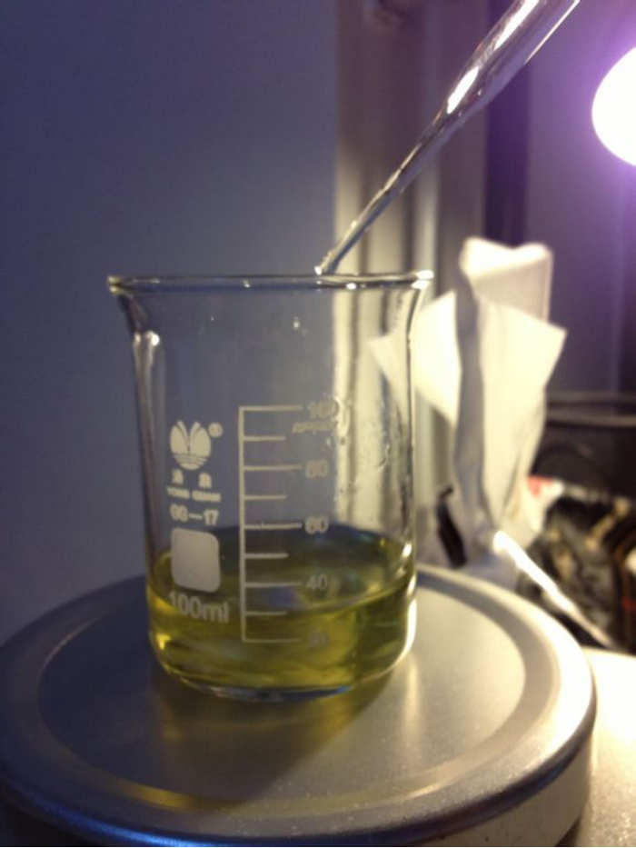
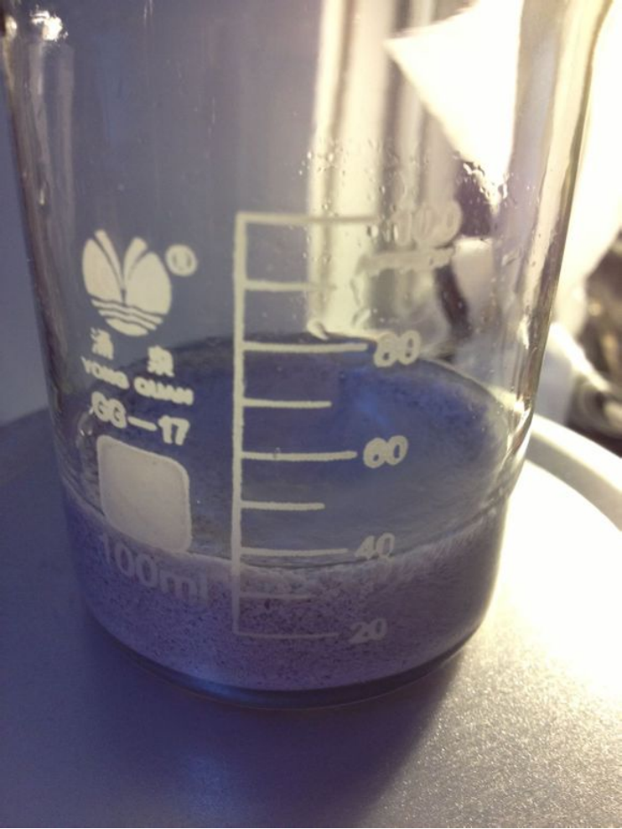
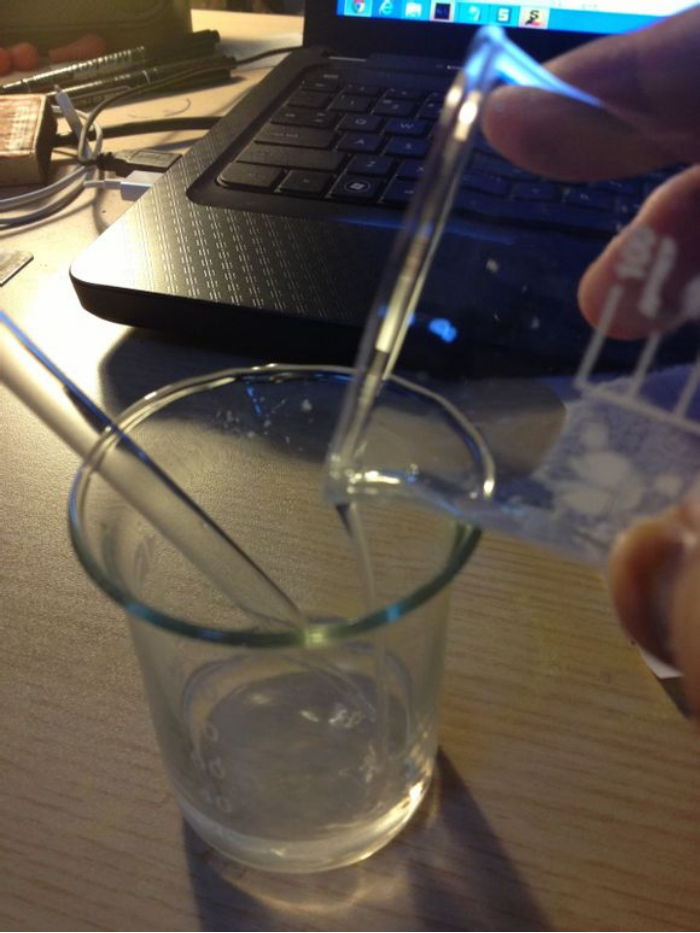
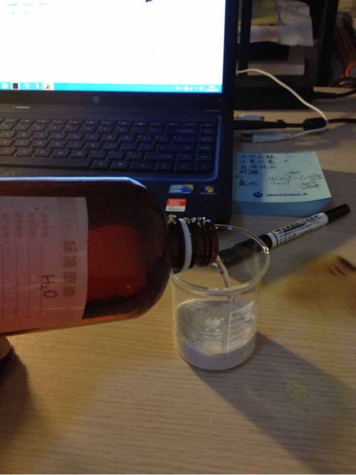

## 叠氮化银的介绍

[Ag+].[N-]=[N+]=[N-]

叠氮化银，白色粉末，熔点252℃，沸点297℃，不溶于冷水和碱，难溶于沸水，微溶于氨水，溶于稀硝酸等，对热或撞击敏感。

## 实验部分

!!! warning "警告"
    **叠氮化钠和叠氮化氢有剧毒**

### 所需试剂和仪器

**试剂**

* 银
* 稀硝酸
* 叠氮化钠
* 蒸馏水

**仪器**

* 电子秤
* 烧杯
* 电磁炉
* 漏斗
* 滤纸
* 玻璃棒
* 抽滤装置
* 磁力搅拌机&搅拌子

### 步骤

* 称取3.3g`银`于烧杯中。  
  
  
* 加入适量`稀硝酸`，加热，如`银`无法全部溶解可补加`稀硝酸`。  
  
* 加热  
  
* `银`完全溶解后，再持续煮沸溶液数分钟，以除去过量的`稀硝酸`，防止后续步骤中生成剧毒的**叠氮化氢**气体。  
  
* 我直接蒸成**硝酸银**固体了，然后加适量`蒸馏水`溶解，过滤，加`蒸馏水`稀释至20毫升左右，便得到了澄清的**硝酸银**溶液。  
  
  
* 称取2g`叠氮化钠`，用20ml`蒸馏水`溶解。**这玩意儿剧毒，不要撒到外面，不要接触皮肤。**  
  
* 将`叠氮化钠`溶液置于`磁力搅拌机`上凉拌，并滴入**硝酸银**溶液，可以看到产生了大量白色沉淀。**溶液为黄色的原因是没洗干净的搅拌子污染，对实验无影响**  

* 倾析溶液，再加`蒸馏水`洗涤，反复数次。  
  
  
* 抽滤，干燥，得产物，产量4.0g（已去皮），产率87.273%。  
  
  

## 备注

如果您遵循本指南的制作流程而发现问题或可以改进的流程，请提出 Issue 或 Pull request 。