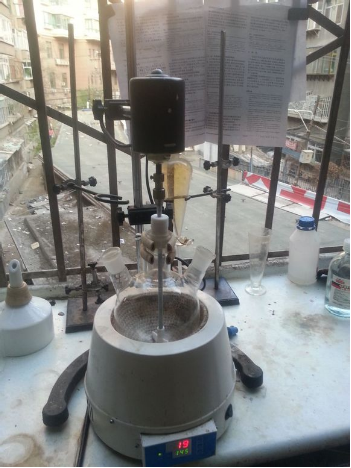
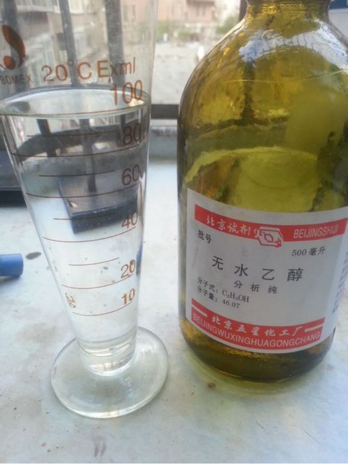
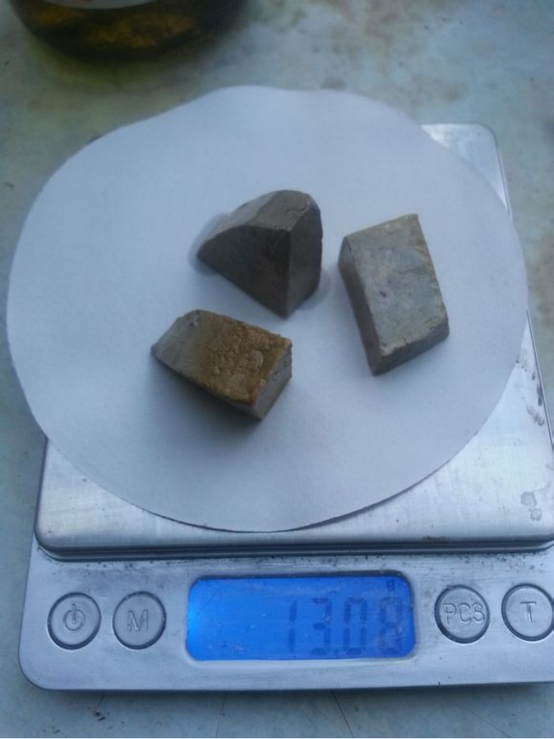
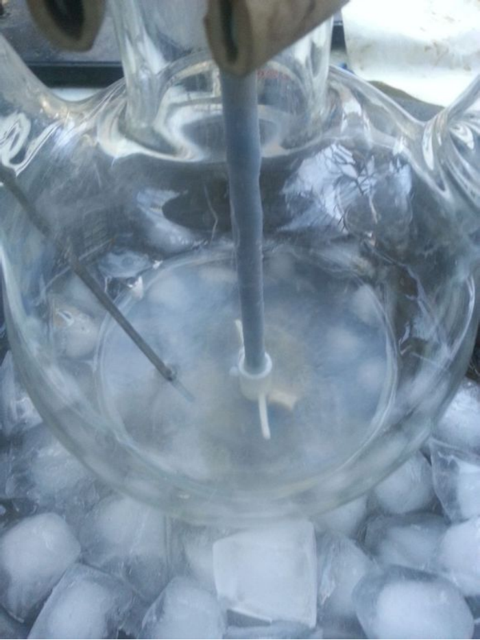
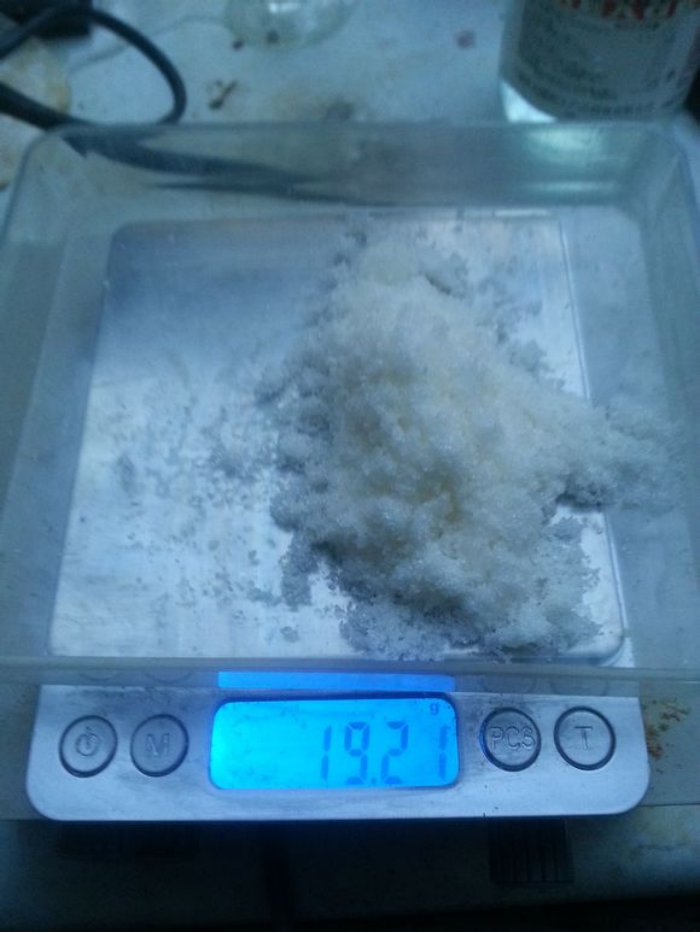
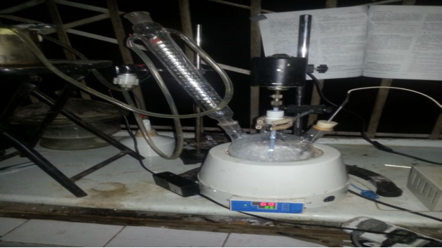
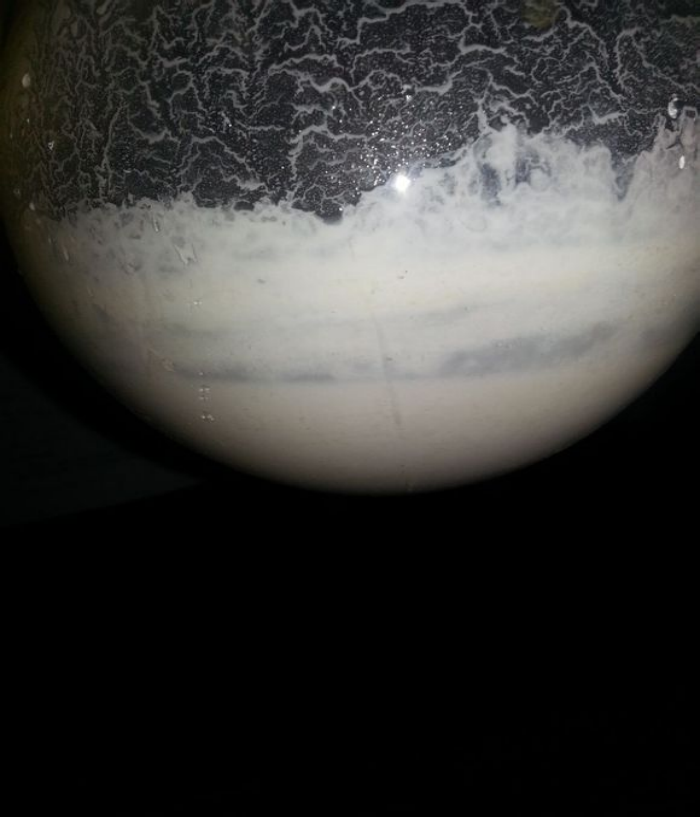
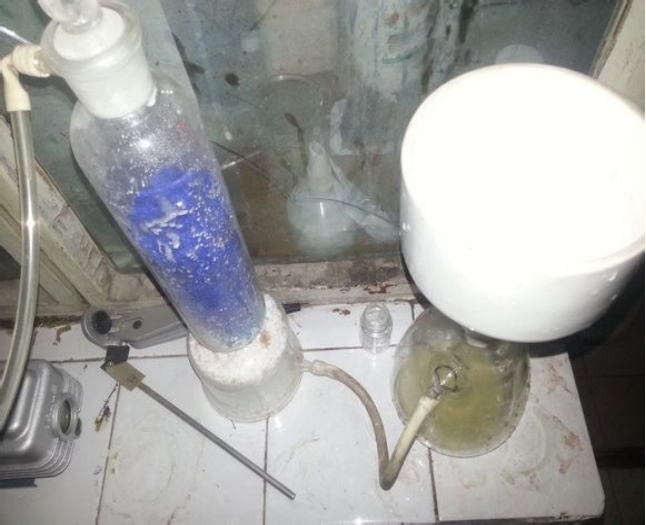
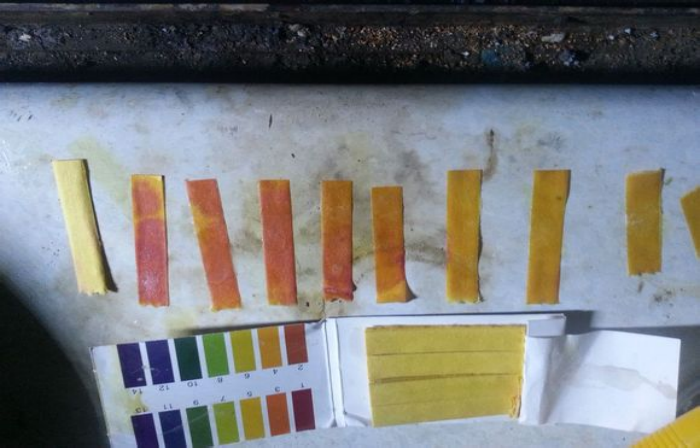

## MPO的介绍

CC1=NC(=CC(=O)N1)O

2-甲基-4,6-嘧啶二酮(MPO)，具有微弱的苯胺气味，该化合物在常温下不溶于水，但可溶于酸和碱溶液中。  
可以用来制备1,1-二氨基-2,2-二硝基乙烯(FOX-7)

## 实验部分

!!! warning "警告"
    **盐酸有强腐蚀性**  
    **无水乙醇和金属钠易燃**

### 所需试剂和仪器

**试剂** 

* 盐酸乙脒（工业级）
* 盐酸（分析纯）
* 无水乙醇（分析纯）
* 丙二酸二乙酯（分析纯）
* 金属钠（化学纯）

**仪器**

* 电子称
* 胶头滴管
* 烧杯
* 量杯
* 三口烧瓶
* 蛇形冷凝管
* 抽滤一套
* 铁架台
* 控温电热套
* 循环水泵
* JJ-1电动搅拌器
* 梨形分液漏斗

### 步骤

* 实验要用到`金属钠`，所以开始之前干燥以下`三口烧瓶`。  
  
* 150ml的`无水乙醇`加入`三口烧瓶`。  
  
* 13g`钠`。  
  
* 将`乙醇`冷却至尽量低的温度，把`钠`切成小块儿放进`三口烧瓶`。产生大量气泡。  
  
* 19.2g`盐酸乙脒`。  
  
* 13g`钠`全部溶解在了`乙醇`里。  
  
* 量取27ml`丙二酸二乙酯`。  
  
* 先将`盐酸乙脒`加入三口烧瓶中，再加入`丙二酸二乙酯`,（目前温度-1.9℃）。  
  
* 接`电热套`内置探头，恒温90度下回流反应3H（有水/油浴锅也可以）。  
  
* 1.5h后，肉眼基本看不出什么变化。还是乳白色。  
  
* 3h后。  
  
* 抽滤。  
  
* 得到的滤渣溶于500ml左右冰水中，溶液呈淡黄色，碱性，PH 11-12。  
  
* 零度左右滴加`稀盐酸`。  
  
* 每一滴下去都有白色沉淀产生。  
  
* PH到2左右停止滴加，过滤，产物`乙醇`洗涤。

* 干燥后产物17.15g，产率74%，比文献低20%左右，率略低。

## 备注

如果您遵循本指南的制作流程而发现问题或可以改进的流程，请提出 Issue 或 Pull request 。