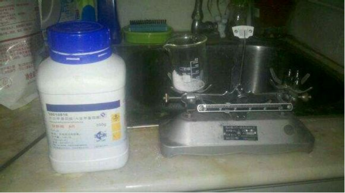
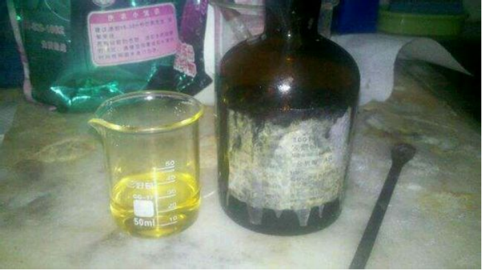

## RDX的介绍

C1N(CN(CN1[N+](=O)[O-])[N+](=O)[O-])[N+](=O)[O-]

RDX也叫环三次甲基三硝或黑索金，无色结晶，不溶于水，微溶于乙醚和乙醇，在丙酮和热苯中略高，在加热的环乙酮、硝基苯和乙三醇中较易溶解。  
相对刻度1.82℃；熔点209℃；爆燃点230℃；爆速8750m/s；爆轰气体体积910L/kg；爆热6025kJ/kg；生成能417kJ/kg。  
化学性质比较稳定，在110℃加热152h，化学稳定性不变。  
50℃长期贮存不分解，遇稀酸、稀碱无变化，遇浓硫酸分解。  
遇明火、高温、震动、撞击、磨擦能引起燃烧爆炸。  
是一种爆炸力极强大的烈性炸药，比TNT猛烈1.5倍。

## 实验部分

!!! warning "警告" 
    **发烟硝酸有强腐蚀性**

### 方案

直接硝化。。。切记，不能使用浓硝酸（68%）与浓硫酸混酸代替发烟硝酸，，因为这样可能得到不安定的副产物，如果尝试，请先预定一个腰子。  

### 所需试剂和仪器

**试剂** 

* 乌洛托品
* 发烟硝酸

**仪器**

* 天平
* 烧杯
* 抽滤装置

### 步骤

* 取20克`乌洛托品`固体。  
  
* 取35g`发烟硝酸`，约40ml。  
  
* 冷水浴的环境下将`乌洛托品`缓缓加入`发烟硝酸`，切记，温度不可超过35摄氏度，并不停搅拌，届时会有一部分棕色**二氧化氮**产生，和一些白色的雾，稳住。  
不要惊慌，虽然**二氧化氮**是高毒物质，但是一定要继续搅拌，不要离开，主要是注意通风。  

   
* 反应完毕后你可以得到一些白色的液体。  
* 加入大量冷水析晶。  
  
* `抽滤`，得到白色固体。

## 备注

如果您遵循本指南的制作流程而发现问题或可以改进的流程，请提出 Issue 或 Pull request 。