## 氰化钾的介绍

氰化钾，俗称山埃钾、青酸加里，是氰化氢的钾盐，化学式为KCN。  
在一般环境下氰化钾是一种呈无色或白色、有杏仁味、外观与糖相似并且易溶于水的固体。

## 实验部分

!!! warning "警告" 
    **氰化钠和氰化钾有剧毒**

### 所需试剂和仪器

**试剂**

* 亚铁氰化钾
* 金属钠
* 无水乙醇
* 无水硫酸铜

**仪器**

* 陶瓷坩埚
* 坩埚钳
* 石墨冷却模具
* 烧杯
* 中速滤纸
* 布氏抽滤漏斗
* 三角瓶
* 橡胶手套
* 铁器皿
* 烤箱
* 卡式炉/煤气灶
* 酒精灯

### 步骤

* 称量25g`亚铁氰化钾`。  
把`亚铁氰化钾`用`铁器皿`放到`酒精灯`或者`煤气灶`上烘干脱水，也可以用`烤箱`加热烘干，用`烤箱`烘干必须要在上面盖上`滤纸`，以免飞溅。  
  
* `亚铁氰化钾`烘干之后，倒入`陶瓷坩埚`内，铺垫在`陶瓷坩埚`底部，只放三分之一。  
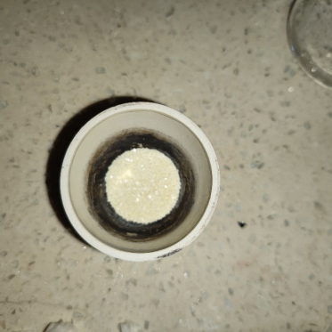  
* 然后称取3g`金属钠`。  
  
* 把`金属钠`擦干石蜡油后，切薄片，切片必须要快，不然会氧化。  
  
* 接下来倒进去。  
  
* 再用剩余的`亚铁氰化钾`覆盖上。  
  
* 必须完全覆盖掉`金属钠`（下图是错误示范）。  
  
* 将其放置在加热器具上，下图是变化过程。  

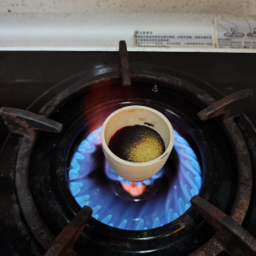  
* 期间不要盖盖子、不要搅拌，搅拌会把底下的`金属钠`带出来。  

  
* 如果过程中有`金属钠`逃逸出来跑到表面并开始燃烧，需要快速用坩埚盖盖上。  
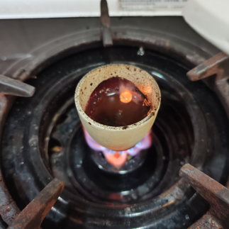  
* `金属钠`未逃逸出来就待到表面液化之后，盖上盖子烧制10分钟。  
  
* 期间可以打开盖子看看是否有澄清液体在表面。  
  
* 看到有澄清液体在表面就说明好了，这时候不要去搅拌，关小火，然后用`坩埚钳`快速夹出倒进`石墨模具`或者随便什么地方（倒的时候注意，只倒上层澄清液体），然后冷却。  
  
* 会得到含有少许黑色杂质的纯白色晶体，刚倒出来还未冷却是有一点发黄，但完全冷却后是发白。  
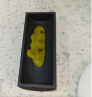

* 如果时间过早就倒出来会导致变成黑色失败，其中铁质未被还原，依旧还是`亚铁氰化钾`（失败品）。  
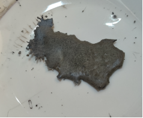  
* 接下里装入`烧杯`捣碎。  
  
* 然后取纯净水少量多次加入烧杯融化，不能加太多水，配成过饱和溶液。融化过程中，禁止使用热水，热水会导致晶体释放**氰化氢**气体！  
* 在等待融化的时间，取一小部分溶液放置在`烧杯`，然后取少量`硫酸铜`水溶。然后将溶液倒入`硫酸铜`溶液内。会发生反应，会生成少量**氰化氢**气体、以及绿色的**氰化亚铜**。如果`硫酸铜`溶液呈红色、黄色则表明失败，呈现绿色带沉淀物则成功。  

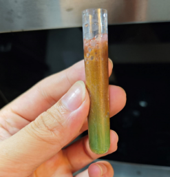  
* 下方是成功的图，有明显绿色，且带沉淀物。  
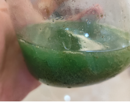
 
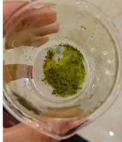  
* 失败则是红色的絮状物。  
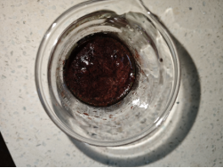  
* 进一步提纯。  
然后用`布氏漏斗`放上两层`滤纸`抽滤（一定要两层，单层会导致从边缘渗漏）  
抽滤后得到的液体，倒入`烧杯`备用。  
接下来清洗`布氏漏斗`、以及抽滤`三角瓶`。  
重新在`布氏漏斗`上面垫上两层`滤纸`。  
接下来把`无水乙醇`倒进刚刚抽滤的溶液里，溶液会变浑浊、出现沉淀物。  
然后倒入`布氏漏斗`抽滤。  
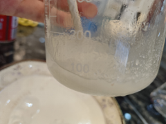
  
* 杯壁上会有残留的，需要用刮刀之类的刮下来放在布氏漏斗上，继续抽滤至无液体滴下。  
抽滤完成后，把滤纸上的白色物体烘干就可以得到至纯的**氰化钾**晶体了。  
  
* 烘干温度不可以太高，否则会过热分解。  
  
* 抽滤后残余的`无水乙醇`里面含有大量的**氰化钠**，可以使用低温冷冻，进一步提纯。  
倒进瓶子里，然后放进冷冻室，冷冻2-3天。让**氰化钠**在低温环境凝固结晶。  
这一步是利用**氰化钠**微溶于无水乙醇的特性，用低温将其分离，在-18度的低温下，溶于水的**氰化钠**会凝固，冻结，会出现分层，而`无水乙醇`凝固点低至-78℃。  

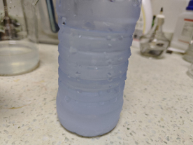  
* 重新组装`布氏漏斗`，垫上`两层滤纸`，将冷冻后的液体摇晃，然后倒入`布氏漏斗`抽滤。  
抽滤后得到的白色晶体为疏松多孔的海绵状晶体。  
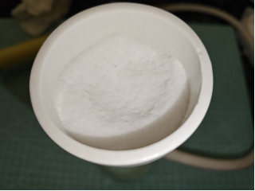
  
* 用东西刮下倒入耐高温器皿中进一步烘干。  
  
* 烘干之后为白色的粉末。  
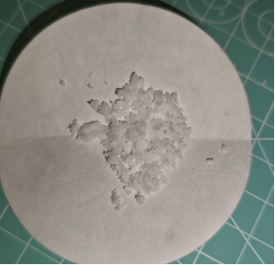
  
* 装入适当药瓶，不要太大的药瓶装，否者药瓶中的空气会逐渐氧化掉**氰化钠**（血泪的教训）。  
  
* 由于作者并非专业人士，0.o所以会有一小部分用词错误或者操作让实验室工作者血压飙升的操作，哈哈哈哈，另外之所以不能使用金属器皿来当反应皿，是因为本实验为用金属钠还原替换掉`亚铁氰化钾`里面的铁，如果用金属器皿的话会让`金属钠`没办法完全还原`亚铁氰化钾`的铁（应该是这样吧，非专业0.o），请看下图。  
  
* 至此，**氰化钠**于**氰化钾**的实验已经结束……

## 备注

作者是Bunny  
Twitter：[Bunny](https://x.com/pyke2076)

**免责声明**  
本文档是为实验室制作氰化钠与氰化钾而撰写，个人禁止制作，所带来的后果请自行承担，文档发布者不负任何责任。  
所有操作者必须佩戴防护并在通风的环境进行实验制取，否者会有中毒高风险。

如果您遵循本指南的制作流程而发现问题或可以改进的流程，请提出 Issue 或 Pull request 。