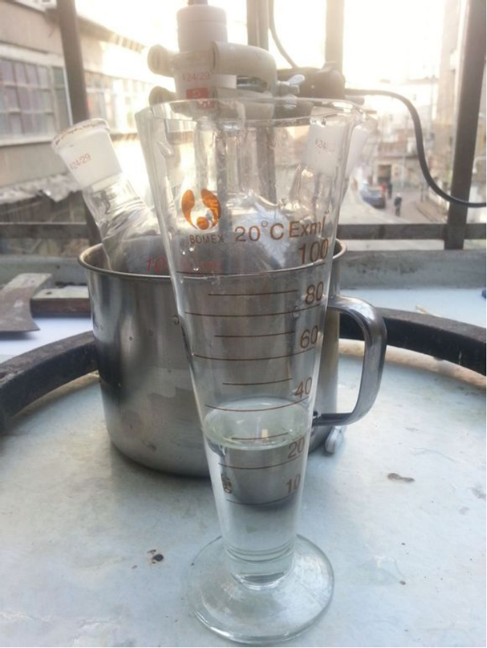
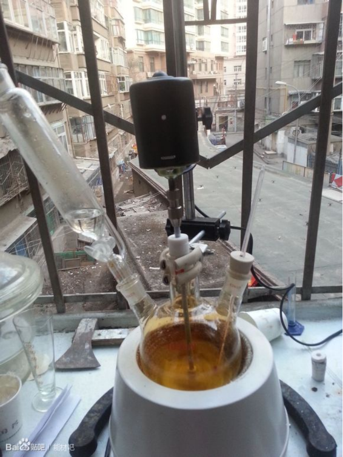
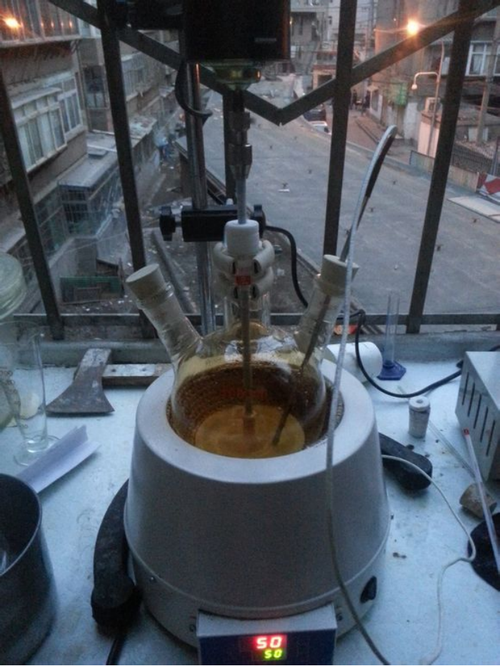

## 4-NI的介绍

C1=C(N=CN1)[N+](=O)[O-]

4-硝基咪唑（4-NI），是合成抗菌抗原虫菌药罗硝唑的重要中间体，是医药领域合成一类消炎药的重要中间体。  
在军工领域的含能材料中4-硝基咪唑是合成1,4-二硝基咪唑的重要中间体。

## 实验部分

!!! warning "警告"
    **浓硫酸，发烟硝酸和氨水有强腐蚀性**

### 所需试剂和仪器

**试剂** 

* 咪唑
* 98%浓硫酸
* 发烟硝酸
* 氨水

**仪器**

* 电子秤
* 烧杯
* 锥形瓶
* 量杯
* 水浴锅
* 三口烧瓶
* jj-1搅拌机
* 温度计
* 铁架台
* 分液漏斗
* 恒压滴液漏斗
* 抽滤装置

### 步骤

* 称取13.6g（0.2mol）`咪唑`。  
  
* 称取25ml左右的`浓硫酸`，并加入有那个在冰水浴中的`三口烧瓶`。  
  
* 搅拌下将`咪唑`缓慢的加入`浓硫酸`中，控制温度不要超过20度，刚开始放热剧烈，有大量白烟生成，后逐渐减缓。  
40min左右加完，再搅拌30min。  
  
* **硝硫混酸**的制备，在锥形瓶中加入25ml`浓硫酸`，再用`分液漏斗`缓慢加入15ml`发烟硝酸`，控制温度在40度以下。  
  
* **4-NI**的合成，将装有**硫酸咪唑盐**的`三口烧瓶`加热到45度，搅拌下用`恒压分液漏斗`缓慢滴加刚才制的**混酸**，控制温度在45-55度之间。  
  
* 继续滴加。有少量的红棕色**NO2**产生。  
  
* 1.5h后滴加完毕，继续在45-55度之间搅拌反应1h。  
  
* 1h过后，溶液偏黄，将其倒入冰水中。  
  
* 加`氨水`调PH至3-4，然后静置半个小时后过滤。  
  
* 抽滤。  
  
* 未干燥的产物。  
   

## 备注

如果您遵循本指南的制作流程而发现问题或可以改进的流程，请提出 Issue 或 Pull request 。