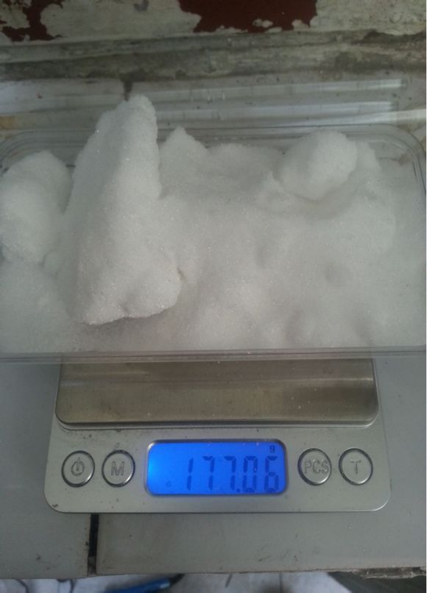
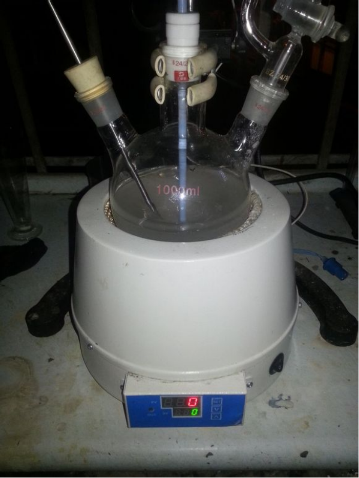
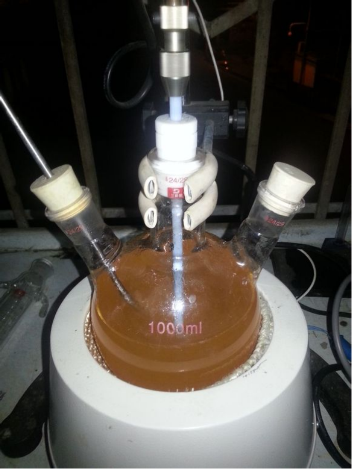
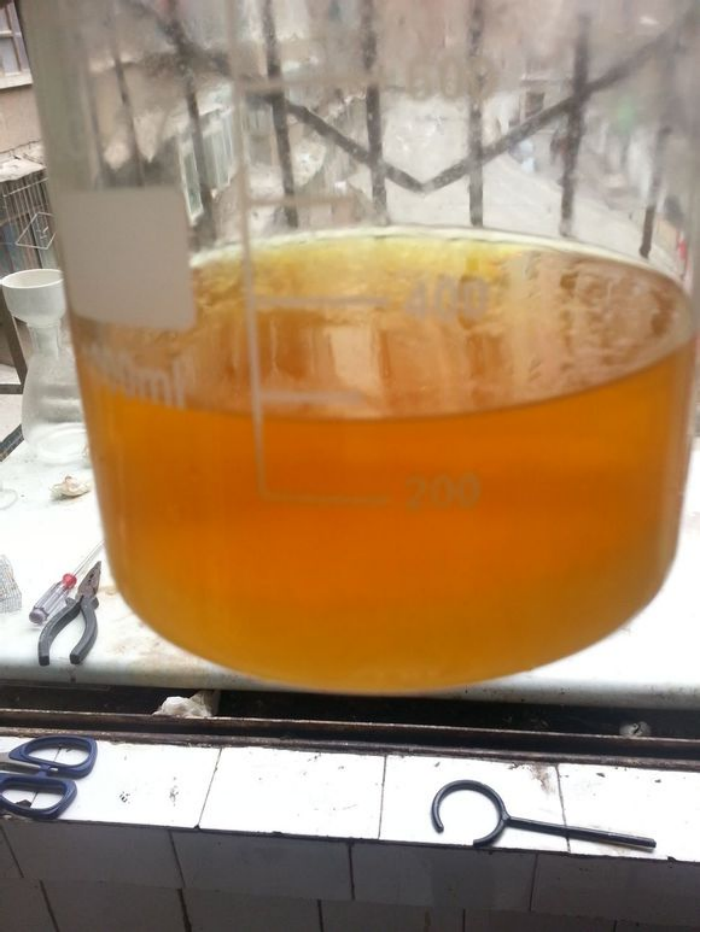
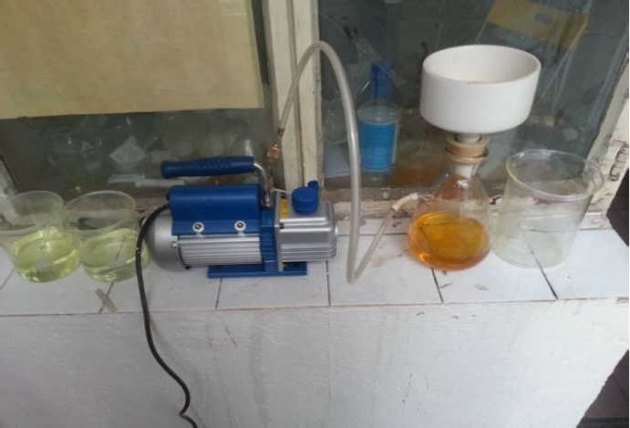

## DAF的介绍

C1(=NON=C1N)N

3,4-二氨基呋咱（DAF）是一种简单的呋喃醇环化合物。  
由于DAF分子具有两个高反应性的相邻氨基，因此它被认为是通过氧化、酰化和叠氮化物反应制备其他复杂含能化合物的基本结构。  
基于DAF的高能化合物包括：氨基硝基呋咱（ANF），3,4-二硝基呋咱（DNF）和4,4-二氨基-3,3-重氮呋咱（DAAF）。

### DAF的合成路线

以乙二醛为原料的方法主要有三种  

* 一步法 乙二醛---->DAF 产率43%
* 两步法 乙二醛---->DAG---->DAF 产率11%
* 三步法 乙二醛---->乙二肟---->DAG---->DAF 产率39%（需要高压）

## 实验部分

!!! warning "警告" 
    **氢氧化钠有腐蚀性**  
    **盐酸羟胺有毒性**

### 方案

本次试验采用一步法

### 所需试剂和仪器

**试剂** 

* 盐酸羟胺
* 氢氧化钠（AR）
* 乙二醛（AR）
* 尿素（AR）

**仪器**

* 电子秤
* 烧杯
* 量杯
* 控温电热套
* 三口烧瓶
* jj-1机械搅拌机
* 368循环水泵
* 抽滤一套
* 温度计
* 铁架台
* 恒压滴液漏斗
* 蛇形回流冷凝管

### 步骤

* 称取112.6g`氢氧化钠`，与136ml水配置成溶液备用。  
  
* 177.06g`盐酸羟胺`。  
  
* 140.09g`尿素`。  
  
* 50ml`乙二醛`。  
  
* 先加`乙二醛`，再加`盐酸羟胺`与`尿素`，最后加入170ml水。  
  
* 搅拌下缓慢滴加刚才配置的`氢氧化钠`溶液，30min滴完。毕后温度升高到31度。  
  
* 滴加完毕，升温到95度，之后关闭加热，温度自然上升到108度。  
  
* 恒温在到102-108度，回流反应15h，（线好乱。。别介意，有空研究下怎么走线看起来有美感）。  
  
* 第二天中午，这是已经回流了14h，(冷凝管里的是**氯化铵**。运气不错，没被堵住，一根用到底) 。  
  
* 15h后，将反应液倒入1L烧杯，冷却至0度，有黄色针晶析出。  
  
* 抽滤。  
  
* 干燥，得到淡黄针状粗品13.3g，产率37%（文献43%，低了一点儿）。  
  

## 备注

如果您遵循本指南的制作流程而发现问题或可以改进的流程，请提出 Issue 或 Pull request 。