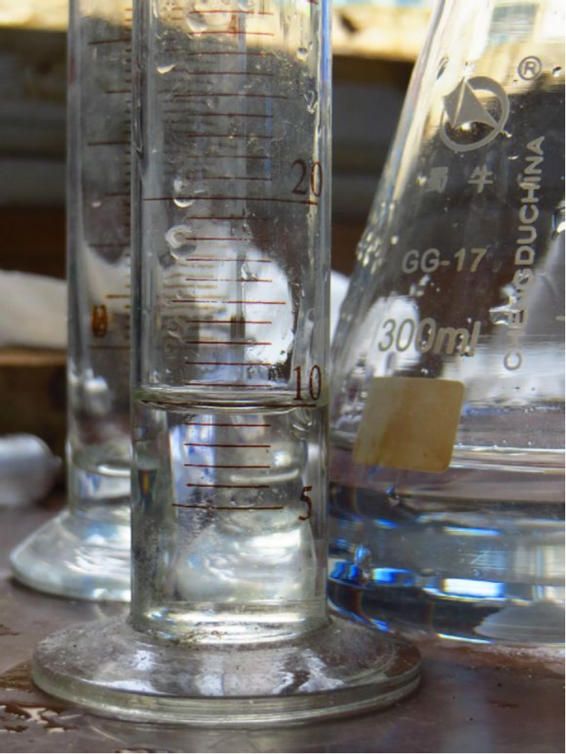
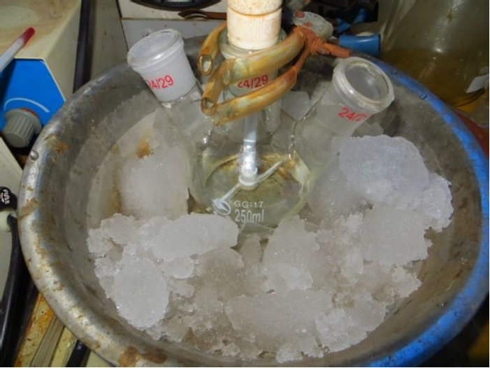
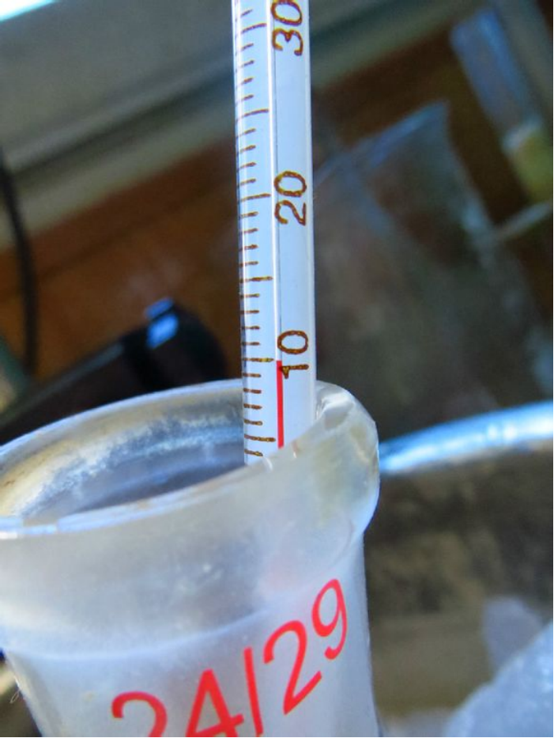
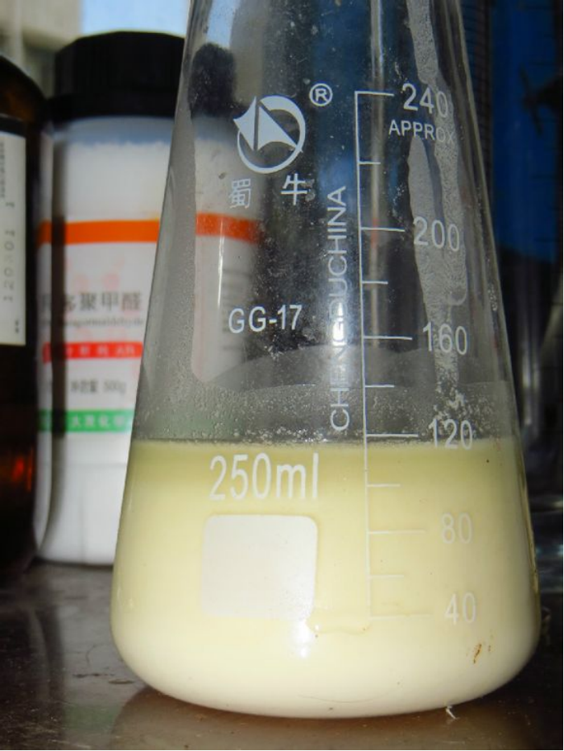
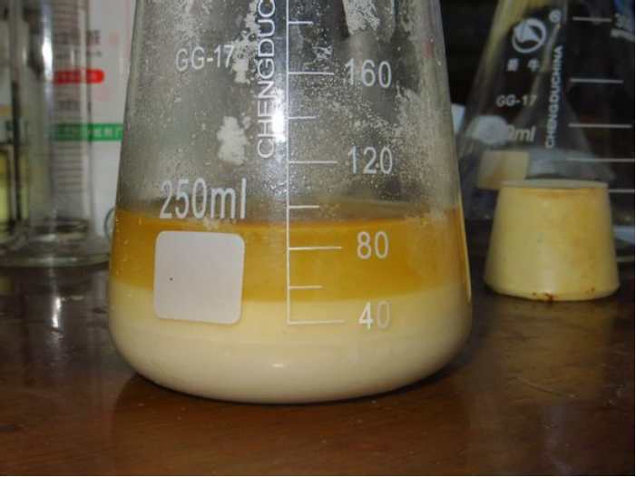
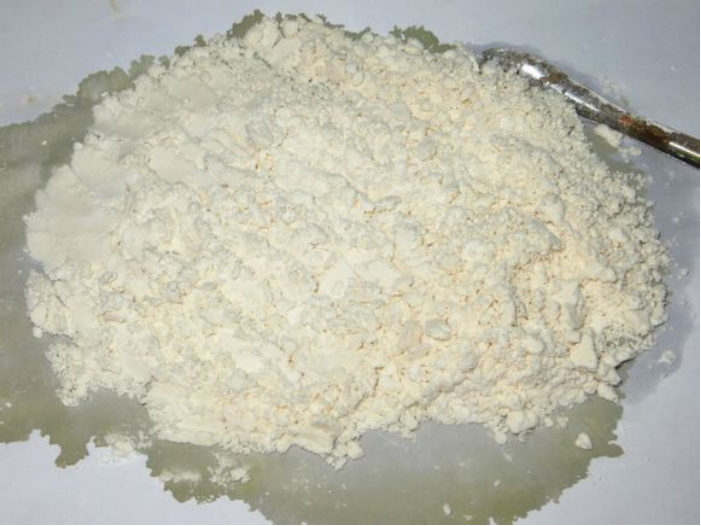
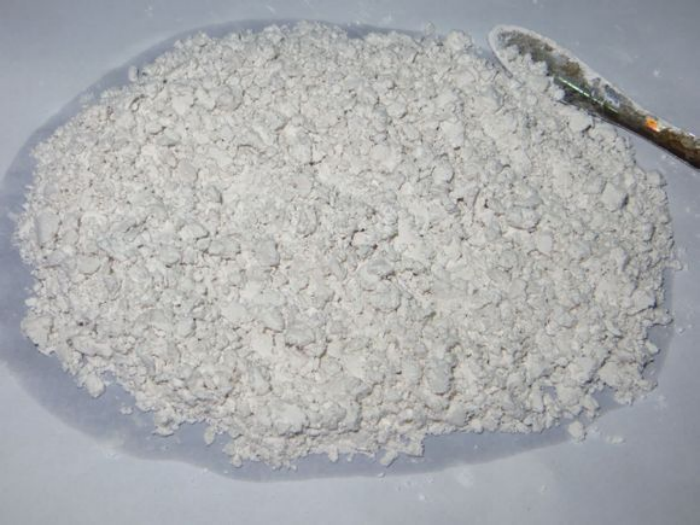

## DFTHP的介绍

OC1C(O)N(C=O)C(O)C(O)N1C=O

DFTHP（1，4二甲酰基-2，3，5，6四羟基哌嗪）是合成TEX的前体化合物，其合成由乙二醛与甲酰胺在碱的催化下缩合而得到。  
TEX是一种新型的高能含能材料，具有顿感、高能量、高密度的优点，其综合性能超越RDX，甚至是HMX。 

### DFTHP的合成路线&反应原理

第一步甲酰胺作为亲核试剂对醛中的羰基的亲核加成，第二步生成的仲胺再进攻醛中羰基而成环，由于DFTHP母体环上的两个甲酰基在硝解时较难脱除，如代以易脱除的乙酰基、丙酰基等则有利于哌嗪含能衍生物的合成。

## 实验部分

!!! warning "警告" 
    **氢氧化钠有腐蚀性**  
    **无水乙醇易燃**

### 所需试剂和仪器

**试剂** 

* 乙二醛（40％aq.）AR分析纯
* 甲酰胺（≥99.3-100.2％）AR 分析纯
* 无水乙醇（≥99.7％）AR 分析纯
* 氢氧化钠（≥96％）AR 分析纯
* 稀盐酸

**仪器**

* 锥形瓶250ml300ml
* 量筒100ml、50ml
* 三角烧杯250ml
* 标准口三口烧瓶 250ml(24#X3)
* 恒压滴液漏斗250ml
* 空心玻璃塞
* 四氟聚乙烯塞
* 温度计0-100℃
* 抽滤一套
* 铁架台
* 烧瓶夹
* 电子天平（500g 0.1g）
* JJ-1电动搅拌器（60W）

### 步骤

* 用`锥形瓶`量取100g`乙二醛`（约87.7ml），放入冰箱冷冻1小时。  
  
* 称取25g`NaOH`，加入`锥形瓶`中。倒入100ml水配成溶液，并冷却至室温。  

  
* 用`量筒`量取10ml`NaOH`（5mol/L aq.）。  
  
* 将`烧瓶`放入冰浴中，安装好`四氟塞`，`电动搅拌器`。  
  
* 慢慢加入`NaOH`溶液至`乙二醛`中。加完后冷却至10℃。 

  
* 在`三口烧瓶`上加装`恒压滴液漏斗`，量取31g`甲酰胺`加入，在20-30min内滴入完毕。  

  
* `甲酰胺`滴加完成后，中止冷却，将`三口烧瓶`从冰浴中撤出，使温度自然上升。
  
* 当反应温度达到37℃左右时，重复冷却，控制反应温度在45℃以下。
  
* 搅拌一段时间后出现白色沉淀，继续反应，到1h左右时可撤去装置。
  
* 将反应液倒入250ml`三角烧杯`中。
  
* 抽滤，滤饼依次用水、`乙醇`洗一遍，最后再用`乙醇`洗涤一遍，抽干。
  
* 滤液不要倒掉，放在`烧杯`中，过段时间又会析出晶体。  
  
* 产物自然晾干。
  
* 理论产量70.864g,实际产量54.7g。产率77.19％。  
  
* 产物精制，`稀盐酸`煮。  

## 备注

如果您遵循本指南的制作流程而发现问题或可以改进的流程，请提出 Issue 或 Pull request 。