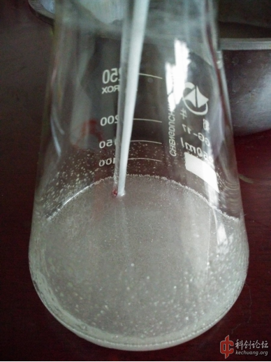
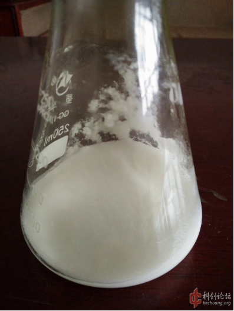
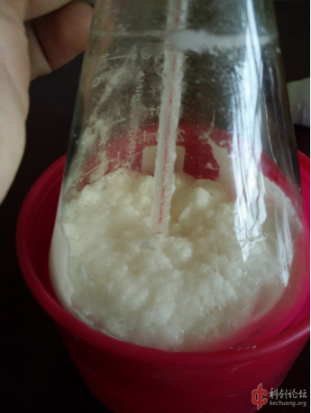
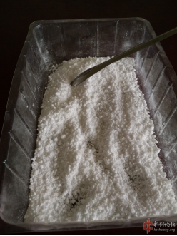

## ETN的介绍

C([C@H]([C@H](CO[N+](=O)[O-])O[N+](=O)[O-])O[N+](=O)[O-])O[N+](=O)[O-]

丁四醇四硝酸酯（ETN），又称赤藓（糖）醇四硝酸酯。  
白色结晶，是类似于季戊四醇四硝酸酯的硝酸酯类猛炸药，感度比PETN略高。

## 实验部分

!!! warning "警告" 
     **硫酸和发烟硝酸有强腐蚀性**  
     **丙酮有肝脏毒性**

### 所需试剂和仪器

**试剂** 

* 98%硫酸
* 发烟硝酸
* 赤藓醇（食品级）
* 碳酸氢钠
* 丙酮

**仪器**

* 电子秤
* 烧杯
* 锥形瓶
* 温度计
* 研钵
* 水盆
* 抽滤装置

### 步骤

* 直接用`锥形瓶`称取55g`浓硫酸`，放入装有自来水的`水盆`冷却至15度以下。  
称取17g`赤藓醇`，研磨成粉状。  
  
* 磺化，将磨成粉的`赤藓醇`加入到`浓硫酸`中，并搅拌，温度控制在35度以内，加完料搅拌5分钟，降温至20度以内备用。  
**PS：反应放热升温不是特别剧烈，加料过程可以较快，甚至可以不用冷却温度也不会特别高，不会存在冒料风险。**  
**个人建议过程温度别太低，否则反应物过于黏稠，会在瓶壁粘结硬化，影响后续硝化均匀性，正常状态类似于办公胶水。**  
  
* 硝化，小`烧杯`称取45g`烟硝`，一次性将一半`烟硝`直接加入`锥形瓶`，在冷却条件下进行搅拌5分钟，让反应物均匀，在温度降至20度以下后，继续一次性将剩余`烟硝`加入反应物，此时可以在无冷却条件下进行搅拌，反应温度无变化后将`锥形瓶`封口，室温放置三小时以上。  
**PS：此阶段整体温升比磺化阶段要小得多，也基本没有任何冒料迹象，反应物由半透明黏稠物变为更黏稠的白色泥状物，封口放置不是必须的，但可以提高得率，对比两次试验，提高6%。**  
  
* 采用热水浴将反应物加热至40-45度之间，保温20分钟，注意搅拌，然后倒入400ml水中，过滤，水洗，`碳酸氢钠`碱洗。  
**PS：保温之后，反应物颗粒感会增强，有极少量`NO2`冒出**。  

  
* 精制，将滤饼放入装有200ml水的`烧杯`中，在搅拌下水浴加热至熔化（61℃），然后水冷静置，取出**ETN**药块，用卫生纸吸干表面水分，得粗品＞38.57g（部分漂浮水表未熔化到一起）。  
将粗品放入干燥`烧杯`，加入`丙酮`，水浴加热溶解，加入少量`碳酸氢钠`浓溶液调节PH值到8，最后冷却，加水，过滤，干燥，称重得**ETN**共计37.8g，总得率90%。  
**PS：`ETN`在`丙酮`中溶解度很大，加热后少量即可溶解这全部粗品，无不溶物。**  
**貌似由于`ETN`低熔点的缘故，`ETN`的`丙酮`溶液加水后溶液不会析出结晶，而是会分层，在降温和加入大量低温水后才开始结晶，药块较软，结晶过程可以用玻璃棒搅拌碾碎。**  

## 备注

如果您遵循本指南的制作流程而发现问题或可以改进的流程，请提出 Issue 或 Pull request 。