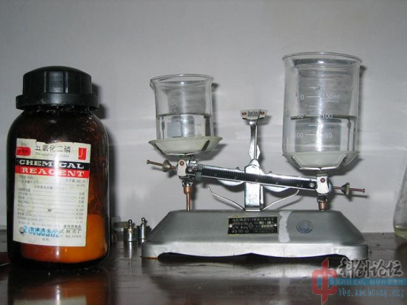
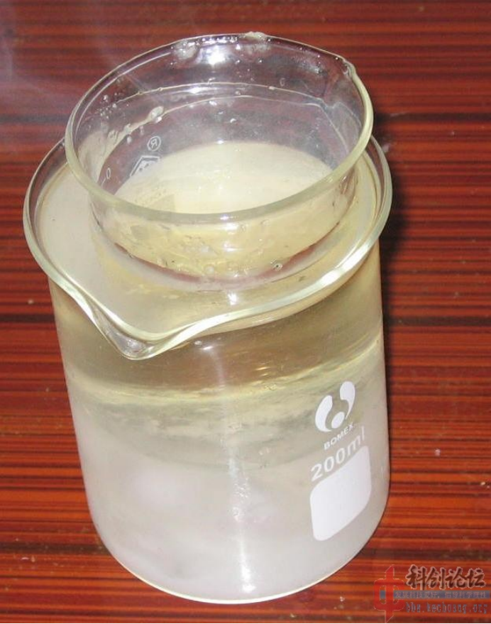

## PETN的介绍

C(C(CO[N+](=O)[O-])(CO[N+](=O)[O-])CO[N+](=O)[O-])O[N+](=O)[O-]

季戊四醇四硝酸酯（PETN），也称戊四硝酯、太安、太恩、膨梯尔，是军事和民用领域较常使用的炸药之一，具有热安定性好、威力大的特性，常作为低爆速、低密度炸药敏化剂和直径较小传爆器件的装药使用。

## 实验部分

!!! warning "警告" 
    **硝酸有强腐蚀性**  
    **磷酸酐有剧毒**

### 方案

磷酸酐与普通硝酸法制取PETN

### 所需试剂和仪器

**试剂** 

* 磷酸酐
* 季戊四醇
* 68%硝酸

**仪器**

* 天平
* 烧杯
* 锥形瓶

### 步骤

* 配制混酸，往`硝酸`里面加入`磷酸酐`是非常麻烦的事，因为在空气中称量它会有非常大的误差，尤其南风天几乎是拿出来就变水。  
所以直接向`硝酸`中添加`磷酸酐`，60ml68%的`硝酸`需要加入60g`磷酸酐`。  
我的`天平`量程只有100g，所以我要构造一个砝码——往150ml`烧杯`里面加了95ml水当作砝码，此前先用冰箱把`硝酸`冷却到0摄氏度以下，在不断搅拌下加入`磷酸酐`，直至天平平衡，温度上升很快，中间要取出作冷却。
  
* 加完后得到油状液体，可以看出温度太高，`硝酸`少许分解，冷却到10摄氏度。    
  
* 加入10g粉碎的`季戊四醇`后，反应很快，得到一杯半流体。  
  
* 倒进水里。  
  
* 剩下过滤了。  
总结：这是一个很不实用的方法，而且成本很高，困难较大，要求很好的通风和较快的手脚，纯当试验，和硝硫混酸的一样做出来是极细的粉末状，10g`季戊四醇`得到20.6g**PETN**。  
这个得率如何？还是不建议用`磷酸酐`做，建议用无水硝酸镁当吸水剂，可以回收。 

## 备注

如果您遵循本指南的制作流程而发现问题或可以改进的流程，请提出 Issue 或 Pull request 。