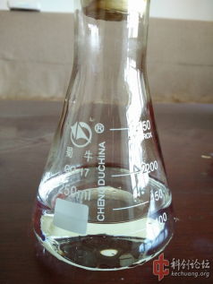
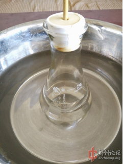
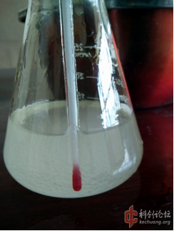
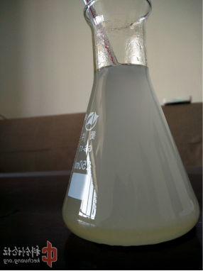

## TMETN的介绍

CC(CO[N+](=O)[O-])(CO[N+](=O)[O-])CO[N+](=O)[O-]

三羟甲基乙烷三硝酸酯（TMETN），又名：甲基异丁三醇三硝酸酯，常温为微黄油状液体，具有挥发性小，吸湿低，摩擦撞击感度低，安定性优秀的特点，其结构与NG类似，粘度约为NG的7.1倍，易溶解胶棉，常被作为新型含能增塑剂使用。

## 实验部分

!!! warning "警告" 
     **浓硫酸和浓硝酸有强腐蚀性**  
     **无水乙醇和乙醚高度易燃**  
     **丙酮有肝脏毒性**

### 方案

原料TME结构类似于季戊四醇，含有三个伯醇基，分析其制备方法可以比照PETN制备方法。  
本次试验采用浓硫酸、浓硝酸混酸制备。  
参考PETN制备混酸配比，设计硝硫比=1:1，最终水分小于30%，根据计算，每百克混酸投料13.3g，实际取13.5g。  
因产物感度低，为减少损失方便计算产率，试验规模扩大为200g混酸，投料27g。

### 所需试剂和仪器

**试剂** 

* 浓硝酸
* 浓硫酸
* 无水乙醇/乙醚
* 丙酮
* TME
* 碳酸氢钠

**仪器**

* 电子秤
* 烧杯
* 锥形瓶
* 温度计
* 水盆
* 干燥箱
* 胶头滴管/注射器

### 步骤

* 分别称取100g`浓硝酸`、100g`浓硫酸`，制备混酸冷却至15度以下备用。  

  
* 同时称取27g`TME`。  
**PS：`TME`虽为大颗粒状，但不需研磨，直接使用。**  
  
* 在搅拌和冷却条件下，将`TME`投入混酸进行硝化，过程温度控制不大于25度即可。  
初期  
  
* 中期  
  
* 后期  

  
硝化初中期明显可见未硝化的`TME`颗粒，无需烦恼，加强搅拌即可，随着硝化的继续，`TME`消失，而油状**TMETN**开始浮现的混酸表面，搅拌后形成细珠状液滴，晶莹剔透，很漂亮。  
* 反应终了无`TME`颗粒后，继续搅拌五分钟，上温水浴，将反应物加热至40-45℃，并保温十分钟，以进行酯交换提高产率。  

  
* 将反应物倒入大量冷水，搅拌后镇静，倾倒上层废酸。  
**PS：注意回收废酸上层漂浮的产物，可通过在锥形瓶中剧烈摇晃让废酸高速旋转，在离心作用下使产物沉底。**  

  
* 将产物在热`碳酸氢钠`（40度左右）中搅拌、震荡洗涤。再转移到小`烧杯`中。  
**PS：*TMETN*粘度较大，热水有助于清除废酸，但仅仅洗涤仍无法完全去除废酸，需要使用`丙酮`、`乙醚`或`乙醇`溶解精制去酸。**  
**洗涤过程注意表面漂浮产物回收，方法同上。**  

  
* 用`胶头滴管`或`注射器`尽可能的吸走表面水分，然后加入少量`丙酮`（一倍体积），搅拌，产物会与`丙酮`混溶。  
**PS：小`烧杯`的好处就是液面直径小，更有利于吸走更多的水，甚至使用试管，以减少`丙酮`用量**   
  
* 将**TMETN**的`丙酮`液倒入稀`碳酸氢钠`热溶液中，搅拌，倾析，再水洗两次，产物装瓶，放入`干燥箱`干燥。  
  
* 等待水分干燥，混溶`丙酮`完全挥发，得到纯**TMETN**共54.4g（瓶重12.6g），产率94.8%。  

## 备注

如果您遵循本指南的制作流程而发现问题或可以改进的流程，请提出 Issue 或 Pull request 。