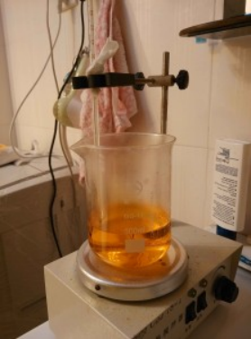
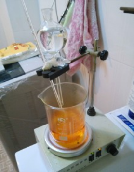
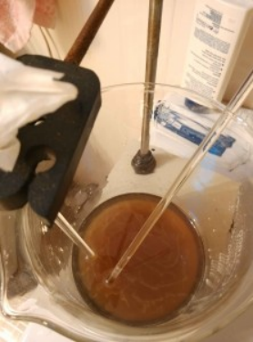
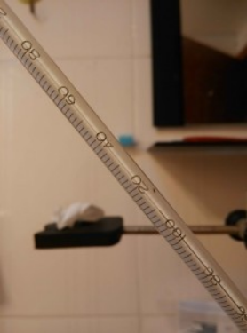
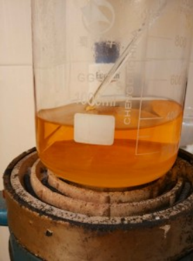
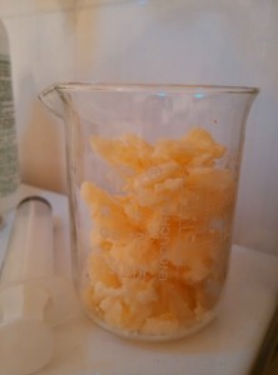
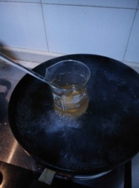

## TNT的介绍

CC1=C(C=C(C=C1[N+]([O-])=O)[N+]([O-])=O)[N+]([O-])=O

TNT是三硝基甲苯的英文缩写，一般指2,4,6-三硝基甲苯。  
该物质于1863年由TJ·威尔伯兰德在一次失败的实验中发明，但在此后的很多年里一直被认为是由诺贝尔所发明，造成了很大的误解。  

2,4,6-三硝基甲苯是一种具有较大威力但十分安全的炸药，其撞击感度为14.7N·m。  
TNT在20世纪初逐渐取代了苦味酸，用于炮弹装药。在第二次世界大战结束前，TNT一直是综合性能最好的炸药，被称为 “炸药之王”。  

TNT味苦，有毒，为淡黄色晶体，暴露在空气中且有日照时颜色会逐渐变深而变质，但少量变质并不影响爆炸。  
TNT在非密闭情况下遇火只会燃烧、冒浓烟，不会爆炸。  
熔铸成块的TNT抗水性强，可直接用于水下爆破，鳞片状的TNT则要注意防水。

## 实验部分

!!! warning "警告"  
    **浓硫酸和发烟硝酸有强腐蚀性**  
    **甲苯高度易燃且有毒性**   
    **DNT和TNT有剧毒**

### 所需试剂和仪器

**试剂** 

* 甲苯
* 浓硫酸(98%)
* 发烟硝酸(≥95%)
* 亚硫酸钠

**仪器**

* 量筒
* 烧杯
* 碗 ？
* 锅 ？
* 电子秤
* 磁力搅拌机
* 温度计
* 分液漏斗

### 步骤

* 打开一瓶250mL装的`发烟硝酸`，将其全部倒入500mL的`烧杯`中。  
  
* 量取75mL`甲苯`，装入`分液漏斗`。  
  
* 在剧烈搅拌下向`发烟硝酸`中缓慢滴入`甲苯`，水浴控制反应液温度不超过50℃，如温控得当，75mL`甲苯`约在1-2h内加完。  
  
* 加完`甲苯`之后，水浴下将硝化液升温到60℃并保温一小时。  
  
* 将硝化液倒入盛有大量冷水的1000mL`烧杯`中，可见大量**二硝基甲苯**析出。  
  
* 倒去上层废酸，再加入开水使其熔融，搅拌清洗5分钟，倒去上层废液。  
  
* 将留在`烧杯`底部的**二硝基甲苯**直接加热熔融并保持一段时间以蒸干水分。  
  
* 用100mL`烧杯`粗略量取100mL`浓硫酸`，缓慢加入熔融的**二硝基甲苯**中。  
  
* 再开一瓶250mL装的`发烟硝酸`，倒入500mL`烧杯`中，然后加入`浓硫酸`至500mL刻度线处，搅拌均匀。  

  
* 将配好的混酸加入溶有**二硝基甲苯**的`浓硫酸`中，加热`烧杯`中的硝化液至105℃-115℃，并保温5-7小时。  
  
* 当硝化液温度升高，**`硝酸`蒸气**和**二氧化氮**会剧烈地冒出，此时应将一盛有冰水混合物的`碗`放在`烧杯`口作为简易回流装置以回收`硝酸`并防止空气污染。  

  
* 5-7小时后，将硝化液倒入大量冷水中，即析出**TNT**晶体。过滤，将**TNT**置于`烧杯`中，加入沸水熔化**TNT**，剧烈搅拌洗涤后倒去上层废液，这样反复数次，洗到上层废液pH值为6.5左右。  
  
* 配制一些0.2mol/L的`亚硫酸钠`溶液（我的`亚硫酸钠`不纯，有黄色杂质），将适量溶液倒入洗涤后的**TNT**中，加热到**TNT**熔融，剧烈搅拌洗涤**TNT**，此时上层废液变成深红色。  
  
* 倒去上层深红色废液，再用第十三步的方法洗涤**TNT**数次，即可得到呈纯净淡黄色的高纯**TNT**，将其转移到250mL的`烧杯`中。  

  
* 向**TNT**中加入少量水，并在`锅`里水浴加热使其熔融，然后向里面加入微量`硫酸`，再剧烈搅拌，然后停止水浴加热，待**TNT**凝固后到去上层废液。  
这步是为了使**TNT**略带酸性，便于保存（上一步使**TNT**带有碱性，而**TNT**遇碱变质）。  
  
* 将不含水的**TNT**水浴加热熔融，浇入模具，制成柱状，保存备用。  
  
* 称得产物质量为101.60克，理论产量为160.11克，产率为63.46%。  
 

## 备注

如果您遵循本指南的制作流程而发现问题或可以改进的流程，请提出 Issue 或 Pull request 。