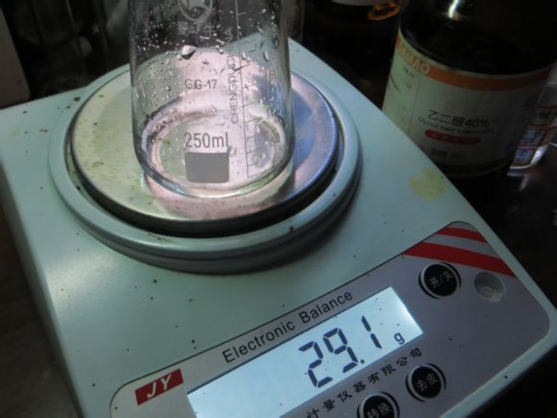
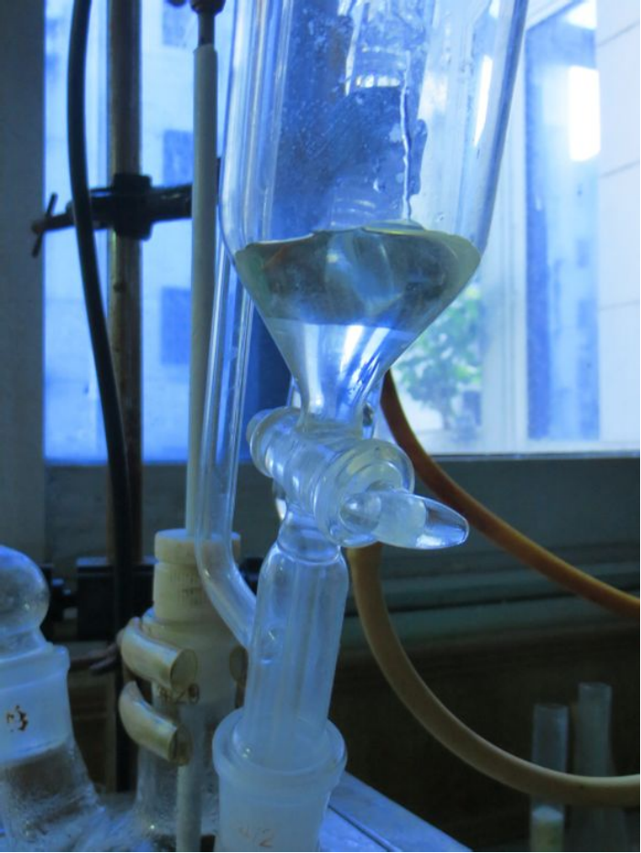
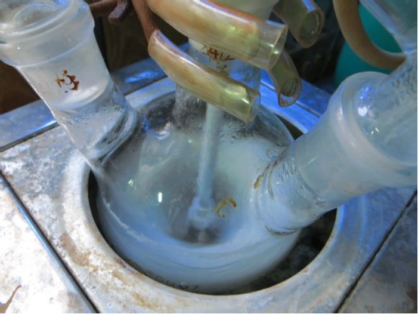
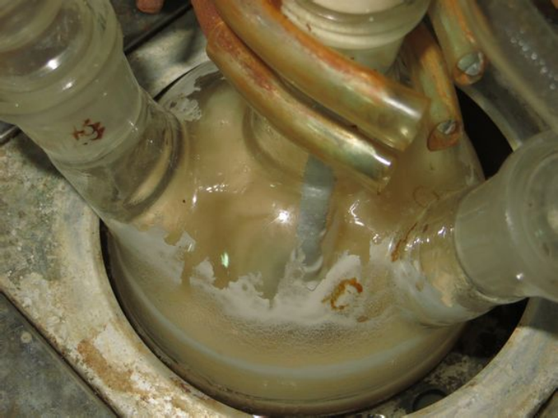
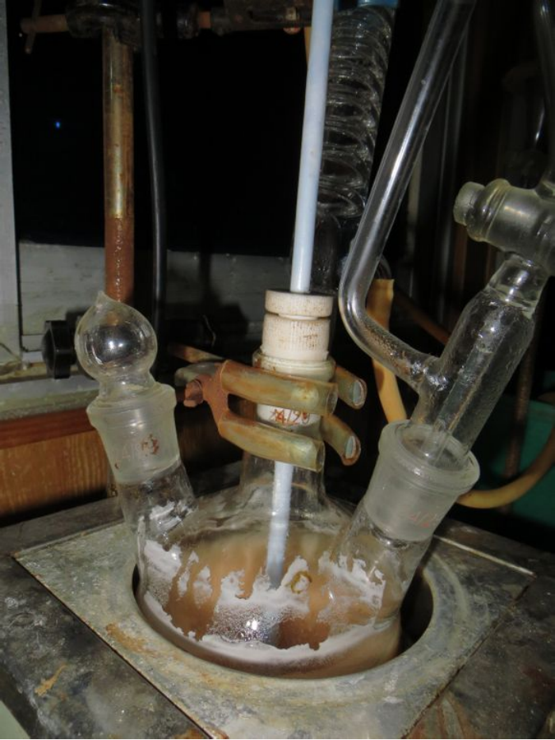
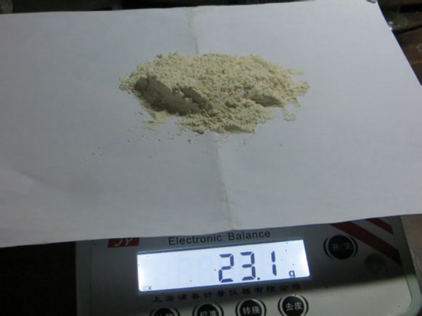

## 甘脲的介绍

C12C(NC(=O)N1)NC(=O)N2

甘脲，系统命名2,4,6,8-四氮杂双环-3,7辛二酮。是一种长效化肥和织物，纸张防湿剂。甘脲的衍生物很多，达上百种，其硝基化合物可作高能炸药，其典型代表为二硝基甘脲、四硝基甘脲以及其水解产物四硝胺基乙烷。  

### 甘脲的合成路线&反应原理

甘脲合成由乙二醛与尿素经过加成、缩合形成甘脲。  
第一步1分子乙二醛与1分子的尿素加成，生成中间体4,5-二羟基咪唑烷酮，第二步再与1分子尿素缩合，环化成甘脲。

## 实验部分

!!! warning "警告"
    **浓硫酸有强腐蚀性**

### 所需试剂和仪器

**试剂** 

* 乙二醛（40％aq.）AR分析纯
* 浓硫酸（≥98％）AR 分析纯
* 无水乙醇（≥99.7％）AR 分析纯
* 脲（≥99.0）AR 分析纯
* 氢氧化钠

**仪器**

* 电子天平（500g0.1g）
* 烧杯500ml，250ml
* 量筒100ml，50ml
* 三角烧杯250ml
* 标准口四口烧瓶 500ml（24#X4）
* 蛇形冷凝管250mm（24*2）
* 抽滤一套
* 烧瓶夹
* 铁架台
* 空心玻璃塞
* 四氟聚乙烯塞
* 恒压滴液漏斗250ml
* JJ-1电动搅拌器（60W）
* 恒温水浴锅

### 步骤

* 称取36g`脲`。  
  
* 量取40ml水加入`脲`中，溶解。  
  
* 用`浓硫酸`调节pH至1.0-2.0。  
  
* 加入装有`机械搅拌器`、`恒压滴液漏斗`和回流`冷凝管`的`四口烧瓶`中，烧瓶置于`恒温水浴锅`中。  
  
* 开启`水浴锅`，设定温度为75℃。  
  
* 称取29.02g`乙二醛（aq.40％）`加入`恒压滴液漏斗`中。  

  
* 达到预定温度，打开`恒压滴液漏斗`的活塞，控制其滴加速度。在5min左右滴加完毕。  

  
* 滴加完毕后溶液立即变白，随后恒温反应2h。

    
* 拆除装置，将反应液倾入`三角烧杯`中。抽滤，并用水、`乙醇`、稀`氢氧化钠`水溶液洗涤。干燥，得到产物。  
  

* 产率=(23.1g/71.058g)x100%=32.5%

## 备注

如果您遵循本指南的制作流程而发现问题或可以改进的流程，请提出 Issue 或 Pull request 。